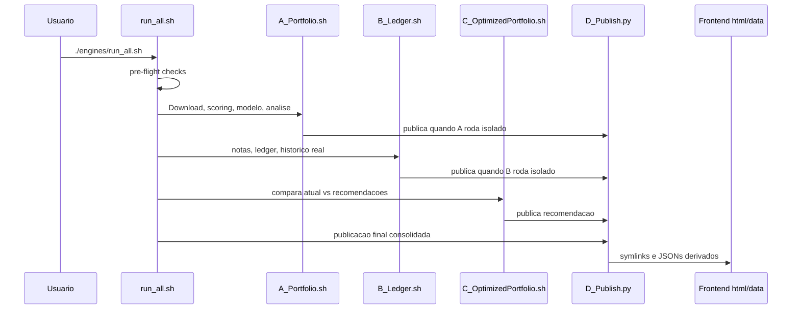
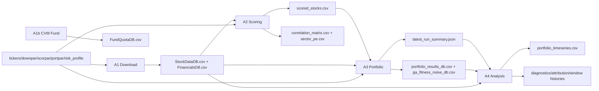
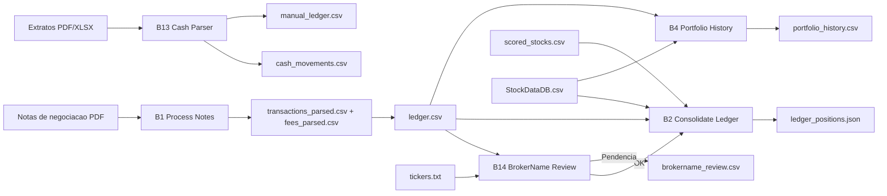
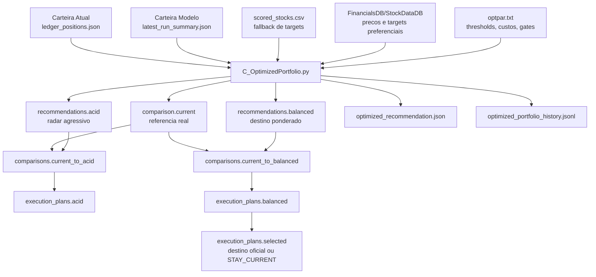
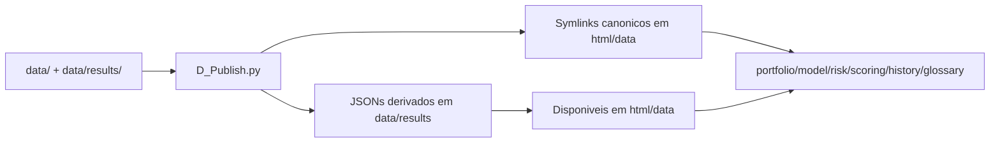
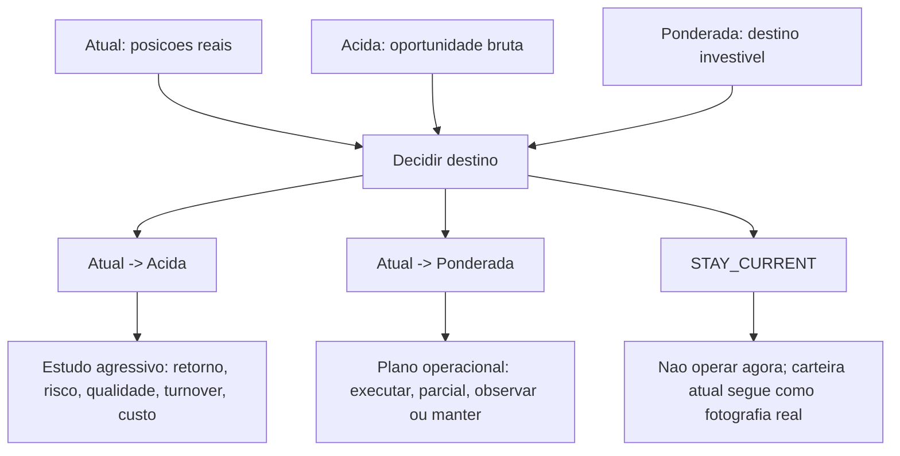

# Mapa Visual Do Pipeline PortfolioESG

Documento de referencia para enxergar a sequencia de execucao, os criterios aplicados em cada etapa, as principais entradas e as saidas que alimentam o frontend.

Ultima leitura do codigo: 2026-06-07.

## Visao Geral

O pipeline tem quatro blocos conceituais:

1. **A - Modelo de mercado**: baixa dados, pontua ativos, gera a carteira modelo e calcula diagnosticos.
2. **B - Carteira real**: processa notas/extratos, consolida posicoes e reconstrui o historico real.
3. **C - Recomendador**: compara a carteira atual contra destinos recomendados e produz planos de execucao.
4. **D - Publicacao**: transforma os artefatos canonicos de `data/` e `data/results/` em arquivos consumidos pelo frontend em `html/data/`.

```mermaid
flowchart TD
  user["Operador local / agenda"] --> runall["engines/run_all.sh"]
  gcpvm["scripts/gcp_vm_runner.sh"] --> gcpsyncin["Sync GCS -> local"]
  gcpsyncin --> gcprunner["scripts/gcp_runner.py"]

  runall --> preflight["Pre-flight: venv, scripts e diretorios"]
  preflight --> stageA["Stage A: A_Portfolio.sh"]
  preflight --> stageB["Stage B: B_Ledger.sh"]
  preflight --> stageC["Stage C: C_OptimizedPortfolio.sh"]
  preflight --> stageD["Stage D: D_Publish.py"]

  gcprunner --> gcpA1["A1_Download.py"]
  gcpA1 --> gcpA2["A2_Scoring.py"]
  gcpA2 --> gcpA3["A3_Portfolio.py"]
  gcpA3 --> gcpA4["A4_Analysis.py"]
  gcpA4 --> gcpsyncout["Sync local -> GCS"]

  stageA --> A1["A1_Download.py"]
  stageA --> A1b["A1b_DownloadFundCVM.py"]
  stageA --> A2["A2_Scoring.py"]
  stageA --> A3["A3_Portfolio.py"]
  stageA --> A4["A4_Analysis.py"]
  stageA --> DfromA["D_Publish.py"]

  stageB --> B13["B13_Cash_Parser.py"]
  stageB --> B1["B1_Process_Notes.py"]
  stageB --> B14["B14_BrokerName_Review.py"]
  stageB --> B2["B2_Consolidate_Ledger.py"]
  stageB --> B4["B4_Portfolio_History.py"]
  stageB --> DfromB["D_Publish.py"]

  stageC --> C["C_OptimizedPortfolio.py"]
  stageC --> DfromC["D_Publish.py"]

  stageD --> D["D_Publish.py"]

  A1 --> datafindb["data/findb/*.csv"]
  A1b --> datafindb
  A2 --> scored["data/results/scored_stocks.csv"]
  A3 --> modelout["data/results/latest_run_summary.json"]
  A3 --> portdb["data/results/portfolio_results_db.csv"]
  A4 --> analysisout["data/results/portfolio_timeseries.csv + historicos"]

  B13 --> cash["data/cash_movements.csv + data/manual_ledger.csv"]
  B1 --> ledger["data/ledger.csv + parsed tx/fees"]
  B14 --> brokerreview["data/brokername_review.csv se houver pendencia"]
  B2 --> positions["data/ledger_positions.json"]
  B4 --> realhist["data/portfolio_history.csv"]

  C --> rec["data/results/optimized_recommendation.json"]
  C --> rechist["data/results/optimized_portfolio_history.jsonl"]

  DfromA --> html
  DfromB --> html
  DfromC --> html
  D --> html["html/data/*"]
  html --> pages["html/sections/*.html"]
```

> Nota operacional: o `run_all.sh` e o orquestrador mestre completo A -> B -> C -> D. O modo GCP atual (`scripts/gcp_vm_runner.sh` -> `scripts/gcp_runner.py`) tem checkpoint para A1 -> A4 e sincronizacao GCS; ele nao espelha integralmente o caminho A -> B -> C -> D do `run_all.sh` no estado atual do codigo.

## Sequencia Mestre Local

`engines/run_all.sh` cria um `PIPELINE_RUN_ID` unico no formato `YYYYMMDD-HHMMSS` e usa esse identificador nas etapas A2, A3 e A4. Ele salva logs em `logs/run_all_<timestamp>.log` e mostra heartbeat enquanto cada bloco roda.

Opcoes principais:

| Opcao | Efeito |
|---|---|
| `--skip-download` | Pula A1/A1b e roda A2, A3 e A4 com dados cacheados. |
| `--skip-ledger` | Pula a etapa B quando nao ha novas notas/extratos. |
| `--only-A` | Roda apenas o pipeline de mercado/modelo. |
| `--only-B` | Roda apenas o pipeline de carteira real. |
| `--only-C` | Roda apenas o recomendador C. |
| `--skip-publish` | Pula a publicacao final D chamada pelo `run_all.sh`. |
| `--dry-run` | Mostra o que seria executado sem rodar os scripts. |

## Entradas Globais

| Entrada | Onde fica | Usada por | Papel |
|---|---|---|---|
| Universo de ativos, setores e nomes de corretora | `parameters/tickers.txt` | A, B, C, D | Define ativos elegiveis, setor, normalizacao de ticker e mapeamento BrokerName. |
| Benchmarks | `parameters/benchmarks.txt`, `parameters/anapar.txt` | A4, D | Define benchmark principal, hoje `^BVSP`, e proxies usados em metricas. |
| Download | `parameters/downpar.txt` | A1 | Periodo, arquivos de destino e regras de coleta de dados. |
| Scoring | `parameters/scorpar.txt` | A2 | Pesos de score, momentum, taxa livre de risco e diagnosticos de target quality. |
| Portfolio modelo | `parameters/portpar.txt` | A3, A4 | Tamanho da carteira, restricoes setoriais, GA/brute-force, simulacoes e HHI. |
| Perfil de risco | `parameters/risk_profile.txt` | A2, A3 | Perfil conservador/moderado/agressivo e ajuste por regime de mercado. |
| Recomendador | `parameters/optpar.txt` | C, D | Thresholds, custos, qualidade, regime, gates, turnover e plano de execucao. |
| Caminhos | `parameters/paths.txt` | B, D e utilitarios | Caminhos para notas, ledger, dados e pasta web. |
| Notas/extratos | `Notas_Negociação/` e arquivos de extrato | B1, B13 | Fonte operacional da carteira real e movimentos de caixa. |
| Historico de precos/fundamentos | `data/findb/` | A2, A3, A4, B2, C, D | Base canonica de precos e fundamentos. |

## Etapa A - Modelo De Mercado

Objetivo: transformar o universo de ativos em uma carteira modelo e diagnosticos de risco/retorno.

| Script | Entradas | Criterios principais | Saidas |
|---|---|---|---|
| `A1_Download.py` | `tickers.txt`, `benchmarks.txt`, `downpar.txt`, Yahoo Finance | Atualiza base incremental, baixa precos e fundamentos, registra progresso. | `data/findb/StockDataDB.csv`, `data/findb/FinancialsDB.csv`, `data/download_progress.json`. |
| `A1b_DownloadFundCVM.py` | CVM open data, CNPJ do fundo | Busca mes atual e anterior; calcula retorno diario da cota. | `data/findb/FundQuotaDB.csv`. |
| `A2_Scoring.py` | `StockDataDB.csv`, `FinancialsDB.csv`, `scorpar.txt`, `risk_profile.txt`, carteira real quando disponivel | Score por Sharpe/upside/momentum, pesos dinamicos, ajuste por perfil/regime, target quality (`high`, `medium`, `low`, `reject`) e matriz de correlacao. | `data/results/scored_stocks.csv`, `sector_pe.csv`, `correlation_matrix.csv`, `scoring_performance.csv`. |
| `A3_Portfolio.py` | `scored_stocks.csv`, `StockDataDB.csv`, `portpar.txt`, `risk_profile.txt` | Seleciona top N, aplica min/max de ativos, limite por setor, heuristica brute-force ou GA, simulacoes, Sharpe/retorno/momentum e penalidade de concentracao. | `data/results/latest_run_summary.json`, `portfolio_results_db.csv`, `ga_fitness_noise_db.csv`, `portfolio_performance.csv`. |
| `A4_Analysis.py` | Ultima carteira modelo, precos, benchmarks, `anapar.txt` | Reconstrui serie temporal do modelo, compara com benchmark, calcula diagnosticos, atribuicao e janelas de performance. | `data/results/portfolio_timeseries.csv`, `portfolio_diagnostics_history.csv`, `performance_attribution_history.csv`, `asset_attribution_history.csv`, `performance_windows_history.csv`. |

## Etapa B - Carteira Real

Objetivo: transformar notas e extratos em uma fotografia auditavel da carteira atual e em um historico diario real.

| Script | Entradas | Criterios principais | Saidas |
|---|---|---|---|
| `B13_Cash_Parser.py` | Extratos de corretora PDF/XLSX | Parser de movimentos de caixa; etapa nao critica, falha nao aborta `B_Ledger.sh`. | `data/cash_movements.csv`, `data/manual_ledger.csv`, manifest. |
| `B1_Process_Notes.py` | PDFs em `Notas_Negociação/`, `paths.txt`, parser B11/B12 | Processamento idempotente por documento, extracao de trades/taxas, rebuild do ledger. | `data/transactions_parsed.csv`, `data/fees_parsed.csv`, `data/ledger.csv`, `data/processed_notes.json`. |
| `B14_BrokerName_Review.py` | `ledger.csv`, `tickers.txt` | Gate de qualidade: se BrokerName nao mapeia para ticker canonico, aborta antes da consolidacao. | `data/brokername_review.csv` quando ha pendencias. |
| `B2_Consolidate_Ledger.py` | `ledger.csv`, `tickers.txt`, `StockDataDB.csv`, `scored_stocks.csv` | Normaliza ticker, agrega quantidade/investido, calcula valor atual e enriquece com preco/target. | `data/ledger_positions.json`. |
| `B4_Portfolio_History.py` | `ledger.csv`, historico de precos | Reconstrui posicoes e valores por data para graficos e metricas reais. | `data/portfolio_history.csv`. |

## Etapa C - Recomendador

Objetivo: comparar a carteira real atual contra destinos recomendados e produzir planos de execucao.

| Conceito | Papel atual | Observacao |
|---|---|---|
| Carteira Atual | Fotografia real vinda de `ledger_positions.json`; referencia de partida. | Nao e uma carteira otimizada. |
| Carteira Acida | Radar agressivo baseado no sinal bruto do modelo/targets. | Ajuda a enxergar oportunidades e distorcoes, mas nao e necessariamente o destino operacional. |
| Carteira Ponderada | Destino investivel/oficial no modelo atual. | No codigo atual ainda deriva da otimizacao estavel da fase 6; a fase 11 planejada cria um gerador independente. |
| Comparacao Atual -> Acida | Mede retorno, risco, qualidade, turnover, custos e trades para migrar para a Acida. | Usada para estudo e radar. |
| Comparacao Atual -> Ponderada | Mede retorno, risco, qualidade, turnover, custos e trades para migrar para a Ponderada. | Base do plano operacional. |
| Plano de execucao | Traduz a comparacao em acao: executar, parcial, observar ou manter. | Aplica tolerancias, orcamento de turnover, custo minimo e maximo de acoes. |

Criterios importantes em `C_OptimizedPortfolio.py`:

| Grupo | Parametros / fontes | O que influencia |
|---|---|---|
| Retorno excedente bruto | `MIN_EXCESS_RETURN_THRESHOLD`, retornos da atual e modelo | Sinal agressivo inicial de `REBALANCE` ou `HOLD`. |
| Preco alvo | `FinancialsDB.csv` primeiro; `scored_stocks.csv` apenas como fallback | Evita sobrescrever targets canonicos por dados derivados quando ja ha target/fonte em FinancialsDB. |
| Target quality | `TARGET_EXTREME_UPSIDE_PCT`, `TARGET_REJECT_UPSIDE_PCT`, `TARGET_STALE_DAYS`, liquidez, classe de ativo | Marca `high`, `medium`, `low` ou `reject`, calcula flags e reduz confianca. |
| Retorno ajustado | `RETURN_ADJUSTMENT_*` | Aplica cap/floor, shrinkage por qualidade e penalidade de incerteza. |
| Regime de mercado | `REGIME_*` em `optpar.txt` | Detecta stress/watch e sugere ajuste de hurdle, shrinkage e turnover budget. |
| Gate operacional | `SHADOW_*` | Compara ganho ajustado contra hurdle dinamico, persistencia, qualidade minima e turnover. |
| Execucao | `EXECUTION_*` | Define banda por ativo/setor, minimo por trade, limite de acoes e orcamento semanal/mensal. |
| Estabilidade | `TURNOVER_PENALTY_*`, `STABLE_*` | Hoje seleciona um candidato mais estavel; sera substituido/isolado pela fase 11 para a Ponderada independente. |

## Etapa D - Publicacao

`engines/D_Publish.py` e o ponto unico entre dados canonicos e frontend. A regra de arquitetura documentada no proprio arquivo e: engines escrevem em `data/` ou `data/results/`; o frontend le em `html/data/`.

Passos principais do publisher:

| Passo | Acao | Saidas relevantes |
|---|---|---|
| 0 | Gera snapshots derivados de historicos CSV. | `portfolio_diagnostics.json`, `performance_attribution.json`. |
| 1 | Cria symlinks canonicos de `data/` e `data/results/` para `html/data/`. | `html/data/*.csv`, `html/data/*.json`. |
| 2 | Gera targets mais recentes por ativo. | `data/results/scored_targets.json`. |
| 3 | Projeta a carteira modelo sobre valor real. | `data/results/pipeline_latest.json`. |
| 4a | Constroi serie diaria real. | `data/results/portfolio_real_daily.csv`. |
| 4b | Calcula TWR real, janelas de risco e retornos mensais. | Metricas usadas em `dashboard_latest.json`. |
| 4c | Consolida dashboard. | `data/results/dashboard_latest.json`, `model_calibration.json`. |
| 5 | Publica manifest de notas processadas. | `processed_notes.json` em `html/data/`. |
| 6 | Publica progresso live. | `pipeline_progress.json`, `download_progress.json`, `scoring_progress.json`, `portfolio_progress.json`. |
| 7 | Gera matriz de correlacao para carteira/modelo. | `correlation_model_portfolio.json`. |
| 8 | Enriquece historico para pagina History. | `html/data/portfolio_history_enriched.json`. |

## Artefatos E Consumo No Frontend

| Artefato | Fonte canonica | Consumidores principais | Conteudo |
|---|---|---|---|
| `html/data/dashboard_latest.json` | `data/results/dashboard_latest.json` | `portfolio.html`, `risk.html`, `model.html` | Snapshot consolidado: real, modelo, risco, decisao, calibracao. |
| `html/data/optimized_recommendation.json` | `data/results/optimized_recommendation.json` | `model.html`, `risk.html` | Recomendacoes Acida/Ponderada, comparacoes, planos de execucao e diagnosticos. |
| `html/data/pipeline_latest.json` | `data/results/pipeline_latest.json` | `portfolio.html`, paginas de resumo | Carteira modelo projetada sobre valor real. |
| `html/data/scored_targets.json` | `data/results/scored_targets.json` | Paginas de scoring/modelo | Target price por ticker da ultima rodada. |
| `html/data/scored_stocks.csv` | `data/results/scored_stocks.csv` | `scoring.html`, diagnosticos | Ranking, target quality, score, fundamentos e momentum. |
| `html/data/ledger_positions.json` | `data/ledger_positions.json` | `portfolio.html`, `risk.html`, `model.html` | Posicoes atuais, quantidades, valor, custo e metadados. |
| `html/data/portfolio_history.csv` | `data/portfolio_history.csv` | `portfolio.html`, `risk.html`, history | Historico diario da carteira real por posicao. |
| `html/data/portfolio_real_daily.csv` | `data/results/portfolio_real_daily.csv` | `portfolio.html`, `risk.html` | Serie diaria real com TWR, benchmark e CDI. |
| `html/data/model_calibration.json` | `data/results/model_calibration.json` | `model.html` | Comparativo historico de versoes, frequencia de trade, turnover e falsos positivos. |
| `html/data/portfolio_history_enriched.json` | Gerado direto por D em `html/data/` | `history.html` | Historico enriquecido combinando A3 e C. |

## Caminho De Decisao Das Carteiras

Leitura correta:

- A carteira atual e sempre a referencia real, nao um "modelo legado".
- A carteira acida responde mais rapido a sinais brutos e volatilidade.
- A carteira ponderada deve representar o destino investivel e conservador.
- `HOLD` ou `STAY_CURRENT` significa "nao executar agora"; depois da fase 11, isso nao deve apagar nem igualar a carteira-alvo ponderada.

## Controles De Qualidade E Pontos De Falha

| Ponto | Onde acontece | O que protege |
|---|---|---|
| Pre-flight | `run_all.sh` | Ambiente Python, scripts executaveis e diretorios essenciais. |
| BrokerName review | `B14_BrokerName_Review.py` | Impede consolidar posicoes com ticker nao normalizado. |
| Arquivos obrigatorios da C | `C_OptimizedPortfolio.sh` | Exige carteira modelo e avisa se posicoes reais nao existem. |
| Target quality | `A2_Scoring.py`, `C_OptimizedPortfolio.py` | Identifica targets extremos, velhos, fallback, baixa liquidez, preco muito baixo e possivel troca de classe. |
| Regime de mercado | `C_OptimizedPortfolio.py`, `D_Publish.py` | Aumenta conservadorismo em stress: hurdle, shrinkage e turnover budget. |
| Publicacao unica | `D_Publish.py` | Evita divergencia entre `data/` e `html/data/`. |
| Checkpoint GCP | `scripts/gcp_runner.py` | Permite retomar A1-A4 depois de preempcao/interrupcao. |

## Estado Atual E Proxima Evolucao

O mapa acima reflete o codigo atual. O ponto conceitual mais importante em aberto e a **fase 11**, ja registrada no plano de implementacao:

- Hoje, a Ponderada e produzida a partir da otimizacao estavel/turnover-aware.
- A fase 11 deve criar uma Ponderada independente, baseada em qualidade, risco, liquidez, diversificacao e retorno ajustado antes da decisao de execucao.
- Depois da fase 11, este documento deve ser atualizado para separar visualmente:
  - construcao da Acida;
  - construcao independente da Ponderada;
  - comparacao Atual -> Acida;
  - comparacao Atual -> Ponderada;
  - plano de execucao.
