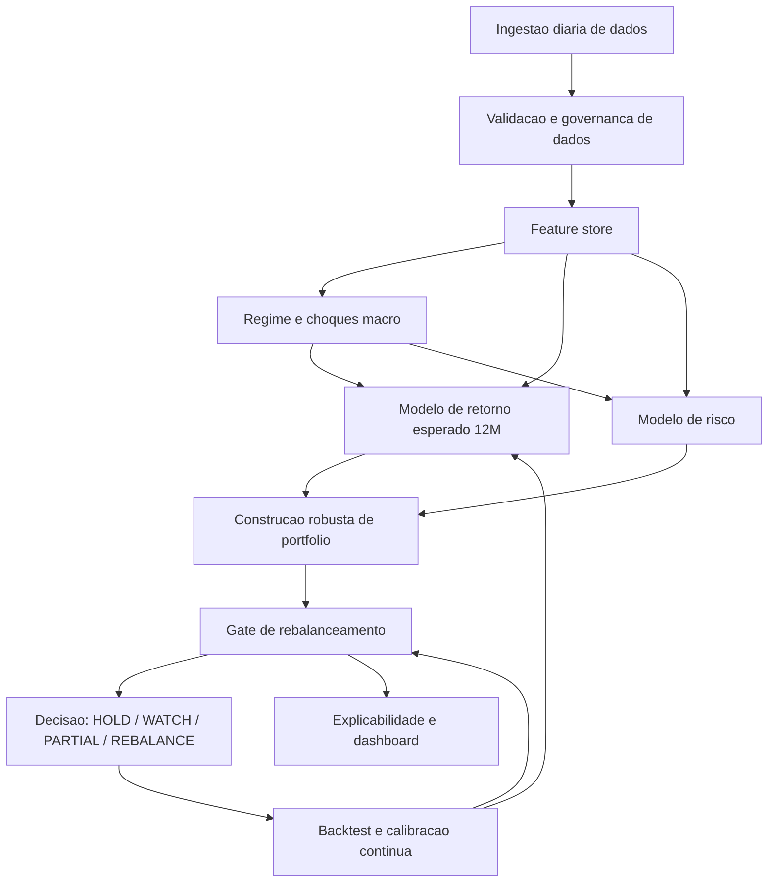

# Analise do Comportamento do Modelo de Recomendacao de Portfolio

Data da analise: 2026-06-04

Esta nota investiga a hipotese de que a queda/reprecificacao recente das acoes da B3 esta aumentando artificialmente o gap entre preco atual e preco-alvo, levando o modelo a projetar retornos esperados muito altos e recomendar rebalanceamentos frequentes. A conclusao e analitica, nao uma recomendacao de compra ou venda.

## 1. Evidencia local: mercado B3 nos ultimos 6 meses

Base local usada:

- `data/findb/StockDataDB.csv`: precos ate 2026-06-03.
- `data/findb/FinancialsDB.csv`: fundamentos e targets ate 2026-06-03.
- `data/results/scored_stocks.csv`: universo pontuado pelo modelo.
- `data/results/optimized_recommendation.json`: recomendacao mais recente.
- `data/results/optimized_portfolio_history.jsonl`: historico de decisoes.

Janela analisada: 2025-12-03 a 2026-06-03, com 161 papeis locais com observacoes suficientes.

Principais achados:

| Metrica | Resultado |
|---|---:|
| Retorno mediano 6M do universo | -7,93% |
| Retorno medio 6M do universo | -10,28% |
| Papeis negativos em 6M | 111 de 161, ou 68,9% |
| Volatilidade anualizada mediana | 37,77% |
| Papeis com volatilidade anualizada acima de 40% | 67 de 161, ou 41,6% |
| Max drawdown mediano 6M | -23,74% |
| Papeis com drawdown pior que -20% | 112 de 161, ou 69,6% |
| Ibovespa na base local, `^BVSP` | +6,03% em 6M, vol. 20,38%, max drawdown -13,66% |
| Ibovespa no grafico acumulado do dashboard | 119,60 em 2026-06-03, apos pico de 138,53 em 2026-04-14; drawdown de -13,66% desde o pico |

Leitura: o indice agregado ainda aparece positivo dependendo da base de comparacao, mas isso nao deve ser interpretado como estabilidade. O grafico acumulado mostra que o Ibovespa devolveu aproximadamente 13,7% desde o pico recente de abril. A dispersao interna tambem e severa: a maior parte do universo caiu, e o drawdown mediano e maior do que a volatilidade do proprio indice. Isso e consistente com um ambiente de rotacao, queda seletiva, stress pos-pico e premio de risco maior, em vez de uma queda homogenea de mercado.

Setores com pior mediana em 6 meses:

| Setor | Mediana 6M | Vol. mediana |
|---|---:|---:|
| Consumer Cyclical | -27,95% | 44,81% |
| Industrials | -19,28% | 38,02% |
| Real Estate | -17,52% | 40,20% |
| Technology | -17,45% | 40,77% |
| Consumer Defensive | -15,29% | 44,66% |

Setores relativamente melhores:

| Setor | Mediana 6M | Vol. mediana |
|---|---:|---:|
| Energy | +20,08% | 33,27% |
| Unknown | +7,42% | 21,38% |
| Communication Services | -2,21% | 39,69% |
| Utilities | -3,94% | 29,81% |
| Financial Services | -4,30% | 29,97% |

Maiores altas na base local em 6 meses:

| Ticker | Retorno 6M | Vol. anualizada | Max drawdown |
|---|---:|---:|---:|
| CBAV3.SA | +74,23% | 26,93% | -7,40% |
| PRIO3.SA | +57,00% | 38,76% | -14,52% |
| AURA33.SA | +54,55% | 73,22% | -38,37% |
| JHSF3.SA | +37,31% | 43,31% | -28,33% |
| OPCT3.SA | +36,96% | 27,36% | -9,24% |
| PETR3.SA | +35,65% | 32,56% | -15,61% |

Maiores quedas:

| Ticker | Retorno 6M | Vol. anualizada | Max drawdown |
|---|---:|---:|---:|
| SBSP3.SA | -80,28% | 119,70% | -84,57% |
| GFSA3.SA | -79,24% | 68,14% | -80,67% |
| AGXY3.SA | -63,20% | 40,85% | -63,64% |
| BHIA3.SA | -62,46% | 67,62% | -63,16% |
| PCAR3.SA | -60,61% | 70,93% | -61,60% |
| RAIZ4.SA | -54,65% | 86,93% | -68,52% |

## 2. Contexto externo recente

Fontes externas consultadas:

- Banco Central do Brasil, decisoes do Copom: https://www.bcb.gov.br/en/monetarypolicy/interestrates
- Banco Central do Brasil, comunicado/ata da 278a reuniao do Copom: https://www.bcb.gov.br/en/monetarypolicy/copomstatements/2658
- IMF, World Economic Outlook April 2026: https://www.imf.org/en/publications/weo/issues/2026/04/14/world-economic-outlook-april-2026
- World Bank, Global Economic Prospects: https://www.worldbank.org/en/publication/global-economic-prospects
- WTO, Global Trade Outlook and Statistics 2026: https://www.wto.org/english/res_e/publications_e/gtos0326_e.htm
- WMO, State of the Global Climate 2025: https://public.wmo.int/news/media-centre/earths-climate-swings-increasingly-out-of-balance
- Reuters/UOL sobre Ibovespa em 2026: https://economia.uol.com.br/noticias/reuters/2026/05/19/ibovespa-fecha-na-minima-desde-janeiro-com-exterior-desfavoravel-e-cenaeleitoral-no-radar.htm
- Reuters/Investing.com sobre disciplina fiscal pos-2026: https://www.investing.com/news/economy-news/brazils-fiscal-discipline-crucial-post2026-election-warns-goldman-sachs-4350652

Sintese:

- Juros e inflacao no Brasil seguem relevantes para equities: em 29/04/2026, a Selic estava em 14,50% a.a., e o Copom ainda tratava inflacao e expectativas acima da meta como riscos centrais.
- O BC tambem citou incerteza externa, conflitos geopoliticos e volatilidade em ativos/commodities como fatores que exigem cautela de emergentes.
- O IMF descreveu o ambiente global como dominado por guerra, fragmentacao geopolitica, incerteza sobre IA e risco de tensoes comerciais renovadas.
- O World Bank apontou crescimento fraco na America Latina, tensoes comerciais, incerteza e demanda domestica lenta.
- A WTO indicou desaceleracao no comercio global em 2026 e destacou, ao mesmo tempo, a forca do comercio ligado a produtos de alta tecnologia/IA.
- A WMO registrou que eventos extremos afetam producao agricola, deslocamento, saude e perdas economicas, o que adiciona risco a setores sensiveis a clima, energia, alimentos e seguros.
- A cobertura Reuters sobre maio de 2026 descreveu correcao no Ibovespa apos forte alta no ano, saida recente de capital externo, commodities mais fracas, juros globais e cena eleitoral/fiscal no radar.

Essa combinacao apoia a premissa de volatilidade elevada, dispersao setorial e incerteza macro. Ela nao, por si so, justifica retornos esperados de 300% a 400% ao ano para um portfolio diversificado.

## 3. Avaliacao da hipotese do usuario

Hipotese: o preco atual das acoes esta sendo reprecificado para baixo, mas o preco futuro esperado nao esta sendo reprecificado na mesma velocidade. Assim, o gap aumenta, o retorno esperado explode e o modelo recomenda rebalancear quase diariamente.

### Argumentos a favor

1. A base local confirma queda ampla e volatilidade elevada fora do indice agregado. A mediana de retorno em 6 meses foi -7,93%, com quase 70% dos papeis negativos.
2. Mesmo o indice agregado, quando visto pelo grafico acumulado do dashboard, esta cerca de 13,7% abaixo do pico recente de abril. Ou seja, o retorno positivo desde a base inicial nao elimina o stress recente.
3. A mecanica de target-based return tende a aumentar upside quando o preco atual cai e o target permanece estavel.
4. Targets de analistas e proxies de valuation normalmente nao sao atualizados diariamente na mesma velocidade do preco de mercado.
5. Em ambiente de incerteza, o target nominal deveria carregar maior erro esperado. Se o modelo usa o target como ponto fixo, ele transforma incerteza em oportunidade.
6. O historico local mostra forte instabilidade de recomendacao: 57 registros entre 2026-03-29 e 2026-06-03, com 36 decisoes `REBALANCE`, 21 `HOLD`, mediana de 13 transacoes por recomendacao e mudanca no conjunto recomendado em 89,3% das transicoes.

### Argumentos contra ou nuances

1. O Ibovespa local ainda aparece positivo dependendo da base inicial. O problema nao e "toda a B3 caiu desde qualquer ponto de partida", mas sim dispersao interna forte, drawdowns relevantes, rotacao e perda importante desde o pico recente.
2. Alguns setores e papeis tiveram alta expressiva, especialmente energia e alguns nomes ligados a commodities. Um modelo pode legitimamente reagir a essas rotacoes.
3. Preco futuro esperado nao precisa cair na mesma proporcao do preco atual. Em algumas quedas idiossincraticas, um target estavel pode indicar oportunidade real.
4. O retorno esperado de 300% a 400% observado no modelo parece menos uma conclusao macro e mais um problema de confiabilidade/calibracao dos sinais de target.

## 4. Principal evidencia de anomalia no modelo

Na recomendacao de 2026-06-03:

| Portfolio | Retorno por target | Retorno historico/pipeline |
|---|---:|---:|
| Carteira atual | 344,30% | n/d no mesmo campo |
| Ideal | 393,80% | 2,72% |
| Otimo discretizado | 403,93% | n/d no mesmo campo |

O retorno esperado de 344% a 404% e explicado quase integralmente por dois ativos:

| Portfolio | Contribuicao KLBN4 | Contribuicao AMBP3 | Soma | Percentual do retorno total |
|---|---:|---:|---:|---:|
| Carteira atual | 221,75 p.p. | 98,79 p.p. | 320,54 p.p. | 93,1% |
| Ideal | 243,41 p.p. | 132,50 p.p. | 375,91 p.p. | 95,5% |
| Otimo | 250,11 p.p. | 136,51 p.p. | 386,62 p.p. | 95,7% |

Detalhe dos principais outliers:

| Ticker | Preco | Target | Upside | Fonte/observacao |
|---|---:|---:|---:|---|
| KLBN4.SA | 3,35 | 24,75248 | +638,88% | `YahooFinance`; target muito proximo do target de KLBN11.SA, que estava em 22,90875 com preco 16,71. Forte evidencia de incompatibilidade entre classe/unidade, ticker ou ajuste de evento corporativo. |
| AMBP3.SA | 0,18 | 1,98 | +1000,00% | Sem `targetMeanPrice`; usa fallback por `SectorPE_Fallback`. O forwardPE local e 0,136 e o sector median PE e 8,33, o que estoura o upside e bate no cap de +1000%. |
| CMIG3.SA | 15,65 | 30,74 | +96,45% | Tambem usa `SectorPE_Fallback`; e menos extremo, mas ainda sensivel a comparacao de PE setorial. |

Leitura: o modelo nao esta apenas capturando "oportunidade de mercado". Ele esta amplificando targets pouco confiaveis ou proxies de valuation em papeis muito depreciados. O efeito fica maior exatamente quando o preco atual cai.

## 5. Hipotese de comportamento desejado

Um modelo alinhado ao objetivo de 12 meses, mas rodando diariamente, deveria separar tres coisas:

1. Monitoramento diario: detectar mudancas, anomalias, deterioracao de risco e novas oportunidades.
2. Estimativa de alpha de 12 meses: atualizar retorno esperado com incerteza, confiabilidade da fonte e regime de mercado.
3. Decisao de trade: aplicar uma politica de rebalanceamento com histerese, custo, imposto, liquidez, estabilidade do sinal e beneficio minimo robusto.

O ponto central: rodar diariamente nao deve significar operar diariamente. O pipeline deve ser rapido; a carteira deve ter inercia deliberada.

Em ambiente volatil, o retorno esperado nao deveria ser um ponto fixo do tipo `target/preco - 1`. Deveria ser uma distribuicao:

- media esperada;
- intervalo de confianca;
- probabilidade de superar a carteira atual;
- perda esperada em cenarios ruins;
- confianca da fonte do target;
- penalidade por anomalias, baixa liquidez, penny/distressed stock e dados stale.

Quando o preco cai e o target nao muda, o modelo deve perguntar:

- O target e recente?
- O target pertence ao mesmo instrumento negociado?
- Houve split, bonificacao, conversao de unit, ticker incorreto ou mudanca de classe?
- A queda foi idiossincratica, setorial ou sistemica?
- A empresa ficou mais barata ou o risco fundamental aumentou?
- O upside vem de analista confiavel, de consenso, ou de um fallback mecanico?
- O tamanho da oportunidade supera ruido, custo e risco de erro do modelo?

Se a resposta for incerta, o target deve ser encolhido na direcao de um retorno base de mercado/setor, nao tratado como verdade.

## 6. Arquitetura teorica recomendada



### 6.1 Ingestao diaria de dados

Entradas:

- Precos, volumes, dividendos e eventos corporativos.
- Fundamentals: EPS, forward PE, dividend yield, divida, margem, crescimento, revisoes.
- Targets: analistas, consenso, fonte, data, cobertura, dispersao.
- Macro: Selic, curva de juros, inflacao, cambio, commodities, fluxo estrangeiro.
- Eventos: eleicao, fiscal, geopolitica, tensoes comerciais, IA/semicondutores/energia, clima.
- Carteira real: posicoes, custo medio, impostos, liquidez e restricoes operacionais.

### 6.2 Validacao e governanca de dados

Camada obrigatoria antes de qualquer score:

- Validar ticker, classe, unit, PN/ON, BDR, ADR e equivalencias.
- Verificar splits, grupamentos, bonificacoes e ajustes.
- Marcar target stale por idade e por ausencia de revisao apos choque relevante.
- Comparar target contra faixa historica, pares e classe correta do ativo.
- Rejeitar ou reduzir confianca de targets incompatíveis com o instrumento negociado.
- Restringir fallbacks de PE setorial quando houver EPS/PE extremos, preco muito baixo, baixa liquidez, distressed names ou setor muito heterogeneo.
- Winsorizar retornos esperados por ativo e por portfolio.

### 6.3 Feature store

Sinais por ativo:

- Retornos 1M, 3M, 6M, 12M.
- Volatilidade, drawdown, assimetria, downside volatility.
- Liquidez, spread estimado, capacidade de execucao.
- Valuation absoluto e relativo.
- Qualidade de lucro e estabilidade de fundamentos.
- Momentum e reversao a media, separados.
- Sensibilidades setoriais e macro: juros, cambio, commodities, China, petroleo, clima.
- Confianca do dado e confianca do target.

### 6.4 Regime e choques macro

O sistema deve produzir um regime com uso direto na decisao:

- `normal`: operar com thresholds padrao.
- `volatile_watch`: monitorar diariamente, aumentar inercia.
- `stress`: reduzir agressividade, aumentar penalidade por turnover e exigir maior persistencia.
- `dislocation_opportunity`: permitir trades, mas apenas quando queda de preco nao vier acompanhada de deterioracao fundamental.

Sinais de entrada:

- Volatilidade e drawdown do mercado.
- Dispersao cross-sectional.
- Fluxo estrangeiro.
- Curva de juros/Selic.
- Commodities e cambio.
- Calendario eleitoral/fiscal.
- Eventos geopoliticos, comerciais, IA/energia e clima.

### 6.5 Modelo de retorno esperado 12M

Proposta: retorno esperado como distribuicao, nao ponto unico.

Componentes:

1. Retorno fundamental por target, ponderado por confianca.
2. Retorno por valuation relativo, com shrinkage para setor/mercado.
3. Momentum de medio prazo, com controle de reversao.
4. Penalidade por deterioracao fundamental ou risco idiossincratico.
5. Ajuste macro/setorial por regime.
6. Penalidade por incerteza do proprio modelo.

Forma conceitual:

```text
expected_return_i =
    w_target_i * shrunk_target_return_i
  + w_value_i  * relative_value_return_i
  + w_mom_i    * momentum_return_i
  + w_macro_i  * scenario_adjustment_i
  - uncertainty_penalty_i
```

Onde `w_target_i` cai quando o target e antigo, suspeito, de fonte fraca, incompatível com o ticker/classe ou vem de fallback mecanico.

### 6.6 Modelo de risco

Risco deve incluir:

- Covariancia com shrinkage/fatores.
- Drawdown esperado.
- Concentracao por ativo, setor e fator.
- Liquidez e impacto de mercado.
- Risco de dados/modelo.
- Risco de evento: eleicao, fiscal, commodities, clima, regulatorio.

### 6.7 Construcao robusta do portfolio

Objetivo teorico:

```text
max portfolio_score =
    expected_alpha
  - lambda_risk * risk
  - lambda_turnover * turnover
  - lambda_uncertainty * model_uncertainty
  - lambda_concentration * concentration
```

Restricoes:

- Numero minimo/maximo de ativos.
- Peso maximo por ativo.
- Peso maximo por setor/fator.
- Limite por liquidez.
- Limite de entrada em papeis com dados fracos.
- Limite de exposicao a fallback de target.
- Bandas ao redor da carteira atual para evitar troca por ruido.

### 6.8 Gate de rebalanceamento

O gate deve ser separado do otimizador.

Uma decisao de trade so deve ocorrer quando:

- O ganho esperado liquido supera custo, imposto, slippage e um hurdle de ruido.
- O ganho persiste por N dias ou N rodadas.
- A carteira sugerida tem estabilidade minima contra a recomendacao anterior.
- O turnover requerido esta dentro do orcamento.
- A confianca media do portfolio supera um piso.
- O beneficio por unidade de risco aumenta, nao apenas o retorno bruto.

Exemplo conceitual:

```text
trade_allowed =
    expected_utility_gain > dynamic_hurdle
and signal_persistence_days >= N
and target_portfolio_stability >= S
and turnover <= turnover_budget
and confidence >= confidence_floor
```

O `dynamic_hurdle` deve crescer em ambientes de estresse:

```text
dynamic_hurdle =
    transaction_cost
  + slippage
  + tax_drag
  + k * tracking_error_of_change
  + model_uncertainty_penalty
```

Estados de decisao:

- `HOLD`: nada muda.
- `WATCH`: oportunidade ou risco emergente, mas sem trade.
- `PARTIAL_REBALANCE`: ajuste pequeno, geralmente por bandas ou risco.
- `REBALANCE`: mudanca relevante e persistente.

### 6.9 Explicabilidade

O dashboard deveria explicar:

- Por que o modelo mudou ou nao mudou.
- Quais ativos explicam o retorno esperado.
- Quanto do retorno vem de target de analista, fallback, momentum e valuation.
- Confianca por ativo e por portfolio.
- Custo total de transicao.
- Turnover recomendado.
- Persistencia do sinal.
- Comparacao com manter carteira atual.
- Motivos de veto do gate.

### 6.10 Backtest e calibracao

Calibrar com historico:

- Realizacao de targets versus preco 12M.
- Erro por fonte de target.
- Erro por setor e por regime.
- Turnover realizado versus performance.
- Frequencia ideal de rebalanceamento.
- Thresholds de `dynamic_hurdle`.
- Taxa de falsos positivos em quedas fortes.

## 7. Implicacoes praticas para o desenho do modelo

1. A explosao para 400% a.a. nao deve ser tratada como retorno esperado final sem uma camada de confianca.
2. Targets precisam de controle de qualidade mais forte do que precos.
3. Fallback por PE setorial deve ser uma estimativa fraca, nao equivalente a consenso de analistas.
4. O modelo pode rodar todos os dias, mas a politica de trade precisa ter histerese.
5. O rebalanceamento deve ser acionado por ganho esperado robusto e persistente, nao por diferenca diaria de retorno bruto.
6. Em stress, o modelo deve aumentar a exigencia para trade e reduzir a confianca de targets stale, nao apenas comprar o maior gap.
7. O pipeline deve distinguir "alerta para monitorar" de "ordem para rebalancear".

## 8. Conclusao

A sua hipotese esta substancialmente correta, mas com uma precisao importante: o problema nao parece ser apenas que o mercado atual caiu e os targets nao acompanharam. Na base local, o retorno esperado extremo esta concentrado em poucos sinais de target/proxy provavelmente pouco confiaveis. KLBN4 e AMBP3 explicam mais de 90% do retorno esperado da carteira atual e quase 96% do retorno esperado do portfolio otimo.

Portanto, o comportamento desejado nao exige parar de rodar diariamente. Exige separar monitoramento diario de decisao de trade, transformar retorno esperado em distribuicao com confianca, e criar um gate de rebalanceamento que resista a ruido, targets anomalos e volatilidade de curto prazo.
